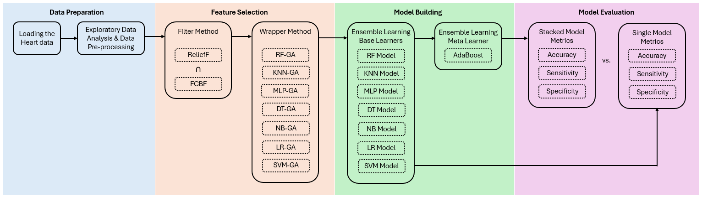
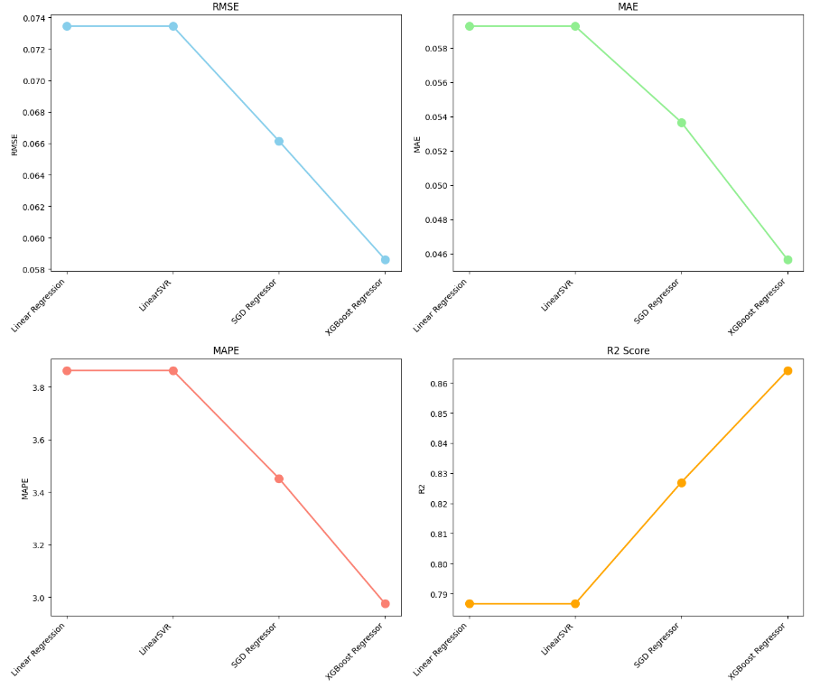

# Aryan-s-Portfolio
Data Analytics Portfolio

## [Heart Disease Prediction Using Genetic Algorithms and Ensemble Learning](https://github.com/Aryan12042001/4830_Project)

**Project Overview:** Developed an advanced predictive model for heart disease using Genetic Algorithms (GA) for feature selection and Ensemble Learning methods. The project aimed to enhance prediction accuracy by optimizing feature subsets and combining multiple models.

**Key Techniques:**
- **Feature Selection:** Employed GA to identify the most relevant features.
- **Ensemble Methods:** Used Stacked Generalization with base models including Logistic Regression, SVM, and Random Forest, and a meta-model (AdaBoostClassifier).
- **Evaluation:** Applied K-Fold Cross-Validation and assessed models using accuracy, sensitivity, and specificity.

**Outcome:** The Stacked Genetic Algorithm model demonstrated superior performance with high accuracy and robustness, outperforming individual models and various feature sets.

## Workflow of the project: 
---

## [Electric Vehicle Lithium-ion Battery Ageing Analysis Under Dynamic Conditions](https://github.com/Aryan12042001/CPSC_4830)

**Project Overview:** Analyzed lithium-ion battery health and performance in electric vehicles using machine learning techniques to predict battery state of health (SOH) and remaining useful life (RUL).

**Key Techniques:**
- **Data Analysis:** Utilized measurements from charge, discharge, and impedance tests.
- **Modeling:** Applied Linear Regression, Support Vector Regression (SVR), and XGBoost Regressor. XGBoost achieved the highest accuracy and lowest error rates.
- **Evaluation Metrics:** Focused on RMSE, MAE, and R2 scores to gauge model effectiveness.

**Outcome:** XGBoost Regressor was identified as the most effective model, significantly improving battery health predictions and providing valuable insights into battery aging dynamics.
## Comparison of the different models tested: 
---

## [DANA_4840 Project: Clustering and Classification](https://github.com/Aryan12042001/DANA_4840_Project)

**Project Overview:** Conducted clustering analyses using k-means, PAM, and hierarchical methods on multiple datasets to explore clustering tendencies and determine optimal cluster numbers.

**Key Techniques:**
- **Clustering Methods:** Implemented partitioning (k-means, PAM) and hierarchical clustering.
- **Research Questions:** Investigated the impact of dimensionality reduction on clustering performance and the interpretation of feature similarities within clusters.

**Outcome:** Delivered insights into clustering patterns and validated clusters, providing a comprehensive understanding of dataset structure and clustering effectiveness.

---

## [MIMIC-III Database Analysis and Classification](https://github.com/Aryan12042001/Mimic-III)

**Project Overview:** Set up and analyzed a PostgreSQL database derived from the MIMIC-III ICU dataset to predict patient outcomes, specifically hospital expiration.

**Key Techniques:**
- **Database Setup:** Created and optimized PostgreSQL tables, indexes, and constraints.
- **Data Processing:** Addressed missing values, selected features using PCA, and cleaned data for analysis.
- **Modeling:** Developed a Gradient Boosting Classifier and examined the impact of dimensionality reduction on model performance.

**Outcome:** Successfully built a robust predictive model for patient outcomes, highlighting key features influencing hospital expiration and demonstrating effective data handling and analysis skills.
