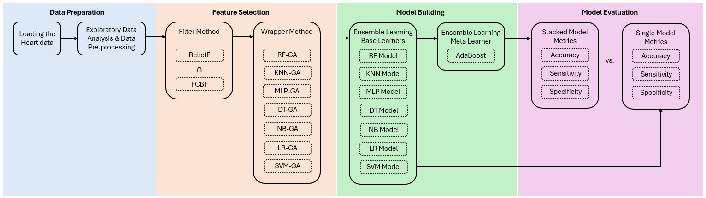
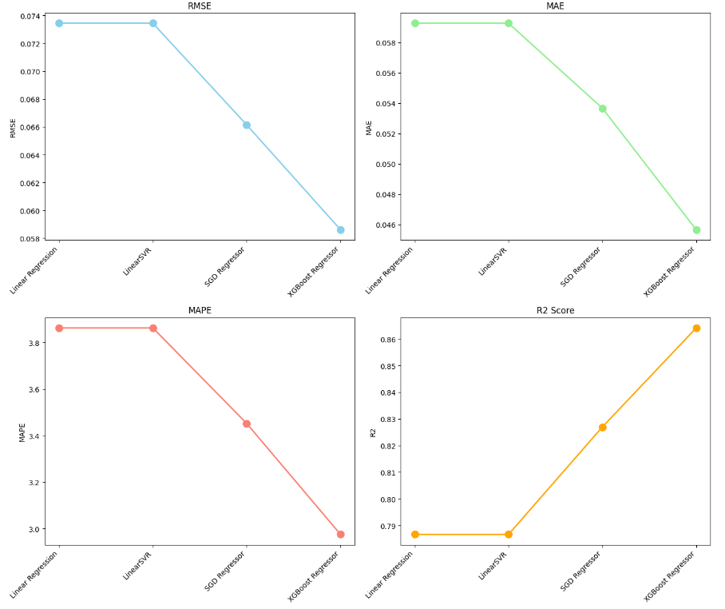
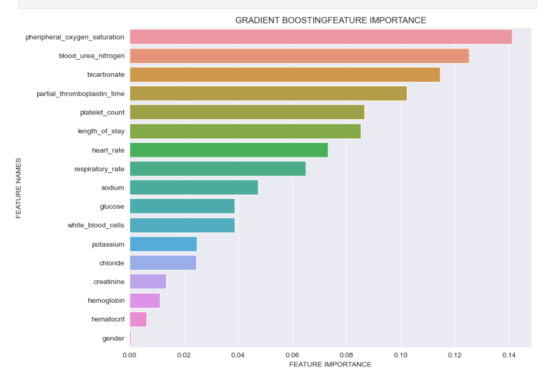

# **Data Analytics Portfolio**

## **Featured Projects**

### **S&P 500 Live Dashboard with ChatGPT Integration**  
**Project Overview**  
This dashboard is designed to visualize and analyze the S&P 500 index's performance across multiple timeframes. Built using Python’s Streamlit and Plotly libraries, it delivers real-time interaction and data analysis. The integration of ChatGPT enhances the user experience by providing contextual insights about selected data points, such as economic or news events impacting market performance (e.g., COVID-19 during 2019-20).  

**Key Features**  
- **Data Visualization**: Offers candlestick, line, bar, and table views for versatile analysis.  
- **Dynamic Filters**: Enables users to focus on specific timeframes like 1 month, 1 year, or the full dataset.  
- **Interactive Insights**: Allows users to click on a specific date to access detailed insights generated by ChatGPT.  

**Advanced Analysis**  
- Weekly percentage changes categorized into meaningful bins (e.g., "Significant Increase," "Extreme Decrease").  
- Custom color coding highlights increases and decreases for pattern recognition.  

**Macro-Economic Context**  
- Includes indicators like CPI, GDP, inflation rates, and S&P 500 earnings to add depth to market performance analysis.  

**Technical Details**  
- Preprocessed data for accuracy and performance, using Streamlit’s caching to optimize.  
- Implemented `plotly_events` to capture user interactions for deeper data exploration.  

**Impact and Future Applications**  
- A valuable tool for investors and analysts to make data-driven decisions.  
- Future scope includes expanding to other indices or stocks and incorporating predictive modeling.  

---

### **Glycerin-to-Glycol Production Using Machine Learning**  
**Project Overview**  
This project optimizes the conversion of glycerin (a biodiesel by-product) into ethylene glycol (EG) and propylene glycol (PG). By leveraging machine learning, it predicts yields, identifies anomalies, and optimizes input variables to streamline production and enhance efficiency.  

**Key Features**  
- **Predictive Modeling**: Built models to forecast yields based on hydrogen flow, pressure, temperature, and other factors.  
- **Optimization**: Used a stacked model with a Genetic Algorithm to increase PG yield by over 7%.  
- **Anomaly Detection**: Implemented machine learning to flag operational issues and predict failures with accuracy.  

**Applications**  
- A potential app for workers to input real-time process parameters and get automated recommendations to optimize production.  
- Can be integrated directly with reactors for real-time automation and control.  

---

### [**Heart Disease Prediction Using Genetic Algorithms and Ensemble Learning**](https://github.com/Aryan12042001/4830_Project)  
**Project Overview**  
This project tackles heart disease prediction by combining Genetic Algorithms for feature selection and Ensemble Learning methods for model optimization. The approach helps healthcare professionals gain better insights into patient outcomes.  

**Key Features**  
- **Feature Selection**: Used Genetic Algorithms to pinpoint critical predictors.  
- **Modeling**: Developed a stacked model with Logistic Regression, SVM, and Random Forest, achieving high accuracy and robustness.  
- **Challenges**: Balancing multiple strong feature combinations during the optimization phase proved complex but led to highly accurate predictions.  

**Applications**  
Provides actionable insights for doctors and nurses to make informed decisions based on predicted outcomes.  
## Workflow of the project:
 - heart-disease
---

### [**Electric Vehicle Lithium-ion Battery Aging Analysis**](https://github.com/Aryan12042001/CPSC_4830)  
**Project Overview**  
Analyzed lithium-ion battery health in electric vehicles to predict the state of health (SOH) and remaining useful life (RUL). This project supports sustainability and the advancement of EV technology.  

**Key Features**  
- **Modeling**: Compared Linear Regression, SVR, and XGBoost models, with XGBoost achieving the highest accuracy.  
- **Practical Implications**: Helps manufacturers improve battery efficiency and lifespan.  
- **Sustainability Impact**: Contributes to eco-friendly advancements by optimizing energy usage and battery longevity.  
## Battery: Comparison of the different models tested:

---

### [**DANA 4840: Clustering and Classification**](https://github.com/Aryan12042001/DANA_4840_Project)  
**Project Overview**  
Explored clustering techniques to identify patterns and tendencies within data, focusing on real-world applications.  

**Key Features**  
- **Clustering Methods**: Applied k-means, PAM, and hierarchical clustering to understand data structures.  
- **Applications**: Techniques can be used for customer segmentation, anomaly detection, and market analysis.  

---

### [**MIMIC-III Database Analysis and Classification**](https://github.com/Aryan12042001/Mimic-III)  
**Project Overview**  
Analyzed patient ICU data from the MIMIC-III database to predict hospital outcomes while maintaining data privacy.  

**Key Features**  
- **Predictive Modeling**: Used Gradient Boosting Classifiers and PCA for dimensionality reduction.  
- **Data Ethics**: Ensured privacy with anonymized data.  
- **Applications**: Provides hospitals with actionable insights to improve patient care and outcomes.  
## MIMIC: Feature importance graph:

---

## **Education**  

### **Post-Degree Diploma in Data Analytics**  
**Langara College, Vancouver, BC**  
*Expected Completion: 2025*  
- **Dean’s Honour Roll, Fall 2024**  

**Highlighted Courses**  
- **Computing for Data Analytics**: Advanced Python programming and data processing.  
- **Data Analysis and Statistical Inference**: Statistical modeling for data-driven insights.  
- **Data Mining for Data Analytics**: Advanced machine learning techniques for predictive modeling.  
- **Visualization for Data Analytics**: Tools and techniques for creating impactful visualizations.  
- **Capstone Project**: Developed a comprehensive project (Glycerin-to-Glycol), integrating machine learning into industrial applications.  
